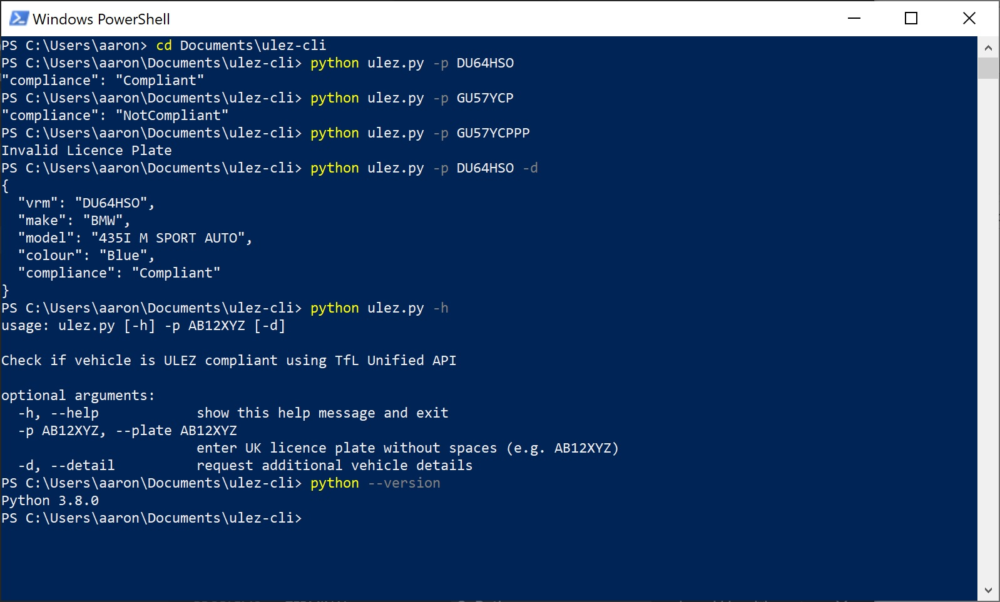

# ULEZ Check Command Line Interface
> A Python script to check a vehicle's ULEZ compliance from your favoured terminal environment

## Table of Contents

- [About](#about)
- [Getting Started](#getting-started)
    - [Installing Python](#installing-python)
    - [Installing ULEZ Check CLI](#installing-ulez-check-cli)
- [Usage](#usage)
- [Contributing](#contributing)
- [Don't Bankrupt Me](#dont-bankrupt-me)
- [License](#license)
- [Contact](#contact)

---

## About


[](LICENSE)


ULEZ Check CLI is a program that gives users the ability to check a vehicle's ULEZ compliance from the command line as opposed to using the website. This program was built in the Python programming language, making use of the popular [Requests](https://pypi.org/project/requests/) library. The Transport for London Unified API is supplying us the data through an AWS API gateway.

**Note:** I generally use the terms "shell" and "terminal" and "command line" interchangably.

---

## Getting Started

### Installing Python

1. This program was developed with Python 3.8, I have yet to test the program for backwards compatibiility so I'd advise you to check your Python version in your terminal with: 

```sh
python --version
```

2. If you have Python 3.8+ installed, you're good. Otherwise install Python from [https://www.python.org/downloads/](https://www.python.org/downloads/)

### Installing ULEZ Check CLI

1. Clone the repo

```sh
git clone https://github.com/aquashi/ulez-cli.git
```

2. You'll need to run the following commands in your shell to navigate to the cloned repo directory and then install the Requests library and its dependencies.

#### On Windows shells

```pwsh
cd path/to/ulez-cli
python -m pip install -r requirements.txt
```

#### On MacOS/Linux shells

```sh
cd path\to\ulez-cli
python -m pip install -r requirements.txt
```

The program should be ready to use now

---

## Usage

Make sure you've used the `cd` command to navigate to the cloned repo directory then run the following command to test the program:

```sh
python ulez.py -p AB12CDE
```
use -h for help and -d for additional car details



For any further questions, feel free to [contact](#contact) me.

---

## Contributing

1. Fork the project
2. Create a feature branch: `git checkout -b feature-branch`
3. Commit your changes: `git commit -am 'Added new features'`
4. Push your changes: `git push origin feature-branch`
5. Create a pull request

---

## Don't Bankrupt Me

I've used an AWS API gateway to upload a working code example to this repo. I didn't want to expose my API credentials but I also want users to test this project with minimal setup however AWS isn't exactly free and my account does have quotas. If you're looking to use this program heavily or do a lot of testing, I'd suggest that you use your own TfL API keys. Sign up for free API credentials at [https://api.tfl.gov.uk/](https://api.tfl.gov.uk/)

Once you have your app id and app key, here's how to incorporate it into the Python program

1. Change the URL endpoint. Here's how to do it. Open [ulez.py](ulez.py) file in a text editor or IDE. Look for the `url` variable in the `check` function. It's on line 16 and should currently display as:

```python
url = f'https://82vqql5ek8.execute-api.eu-west-2.amazonaws.com/live/plate?vrm={plate}'
```

You'll want to replace the old line with this:

```python
url = f'https://api.tfl.gov.uk/Vehicle/UlezCompliance?vrm={plate}&app_id={api_id}&app_key={api_key}'
```

2. Now you could hardcode the `api_id` and `api_key` variables by adding them above the `url` variable declaration inside ~~or outside~~ the check function. See the example below, obviously swap the dummy credentials for your own ones but make sure to keep the variable names consistent with the `url` f-string i.e. `api_id` and `api_key`:

```python
api_id = abcd1234
api_key = abcdef12ghijkl34mnopqr56stuvwx78
```

Make sure you save your changes to the [ulez.py](ulez.py) file.

3. You could stop reading here and the program would work fine with your API credentials. However, it's generally recommended that developers not include API keys in production code, especially when sharing on public repositories like GitHub. To get around this, you could use environment variables. Your API credentials will be saved locally. Admittedly, this will mean the program only works on a machine where appropriate environment variables have been set up.
    
    - You'll still need to replace the URL endpoint a la step 1 but instead of hardcoding the API credentials like shown in step 2, we'll replace it with the following code above the `url` variable declaraton:

    ```python
    api_id = os.environ.get('TFL_API_ID')
    api_key = os.environ.get('TFL_API_KEY')
    ```

    - To allow this `os.environ.get()` function to work, you'll also need to `import` the `os` module. I suggest line 4 or anywhere among the other imports but in theory, you could do the `import` on its own line almost anywhere above the API credential declarations we've just done. Add the following line of code near the top of the file among the other imports:

    ```python
    import os
    ```

    Make sure you save your changes to the [ulez.py](ulez.py) file.

    - Now you'll have to add the environment variables to your machine. Windows 10 allows you to do this using GUI but it's traditionally done via the shell. Type or copy/paste one of the following commands into your preferred shell program of choice. Obviously replace the dummy API credentials with your own but keep the variable names consistent with what we've used in our [ulez.py](ulez.py) file.

    #### On Windows 10 using GUI (no shell)

    - Go to Windows Search by right-clicking the Windows logo or clicking the searchbox in the taskbar or just press the Windows key and then type "environment variables"
    - Click `Edit environment variables for your account`
    - Click `New...` then type `TFL_API_ID` as the Variable name, type your `api_id` (e.g. `abcd1234`) as the Variable value then click `OK`.
    - Click `New...` then type `TFL_API_KEY` as the Variable name, type your `api_key` (e.g. `abcdef12ghijkl34mnopqr56stuvwx78`) as the Variable value then click `OK`.

    #### On Windows Command Prompt (cmd)

    ```sh
    setx TFL_API_ID "abcd1234" && setx TFL_API_KEY "abcdef12ghijkl34mnopqr56stuvwx78"
    ```

    #### On Windows PowerShell (pwsh)

    ```pwsh
    setx TFL_API_ID "abcd1234"; setx TFL_API_KEY "abcdef12ghijkl34mnopqr56stuvwx78"
    ```

    #### On MacOS (bash or zsh)

    ```sh
    export TFL_API_ID=abcd1234 && export TFL_API_KEY=abcdef12ghijkl34mnopqr56stuvwx78
    ```

    #### On Linux (bash, zsh, ksh, sh, or dash)

    ```sh
    export TFL_API_ID=abcd1234 && export TFL_API_KEY=abcdef12ghijkl34mnopqr56stuvwx78
    ```

    #### On Linux (csh or tcsh)

    ```tcsh
    setenv TFL_API_ID=abcd1234 && setenv TFL_API_KEY=abcdef12ghijkl34mnopqr56stuvwx78
    ```
    
Once your environment variables are set, save your [ulez.py](ulez.py) file, close all open shell sessions, then open a new shell and you'll be ready to go with your own API credentials!

---

## License

Distributed under the MIT License. See `LICENSE` for more information.

---

## Contact

**Developer:** Aaron Quashie - aaronquashie@gmail.com

Repository Link: [https://github.com/aquashi/ulez-cli](https://github.com/aquashi/ulez-cli)